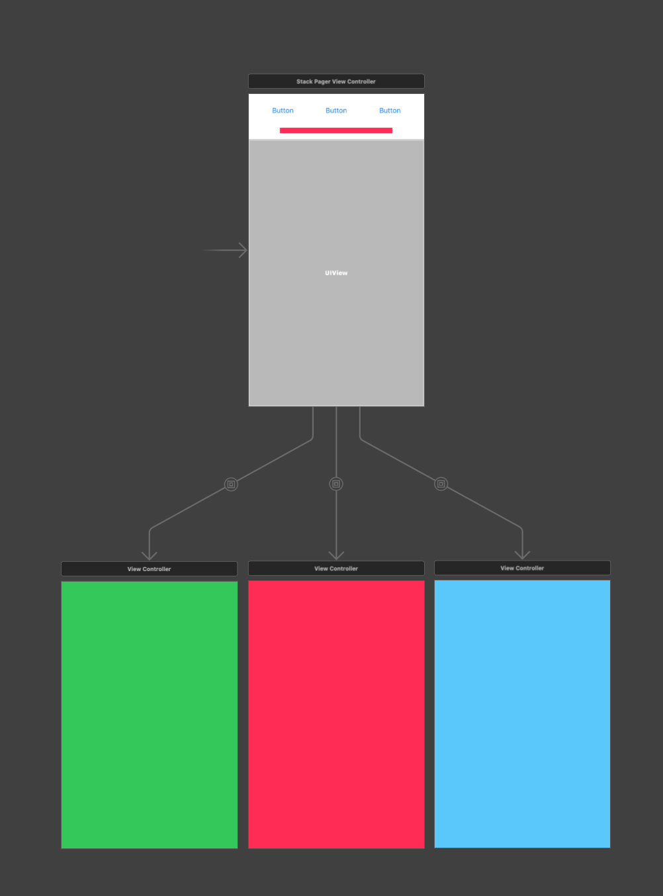
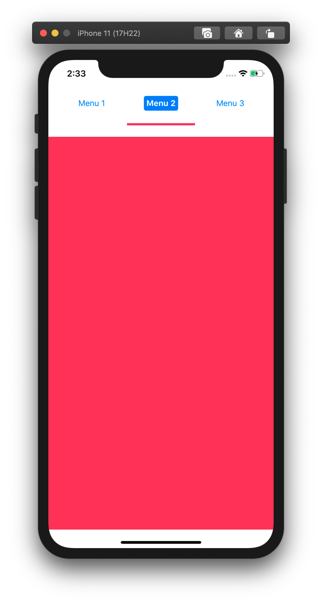

# StackPager

[](https://travis-ci.org/comcxx11/StackPager)
[](https://cocoapods.org/pods/StackPager)
[](https://cocoapods.org/pods/StackPager)
[](https://cocoapods.org/pods/StackPager)

## Example

To run the example project, clone the repo, and run `pod install` from the Example directory first.





## Requirements

## Installation

StackPager is available through [CocoaPods](https://cocoapods.org). To install
it, simply add the following line to your Podfile:

```ruby
pod 'StackPager'
```

## Author

comcxx11, comcxx11@gmail.com

## License

StackPager is available under the MIT license. See the LICENSE file for more info.
